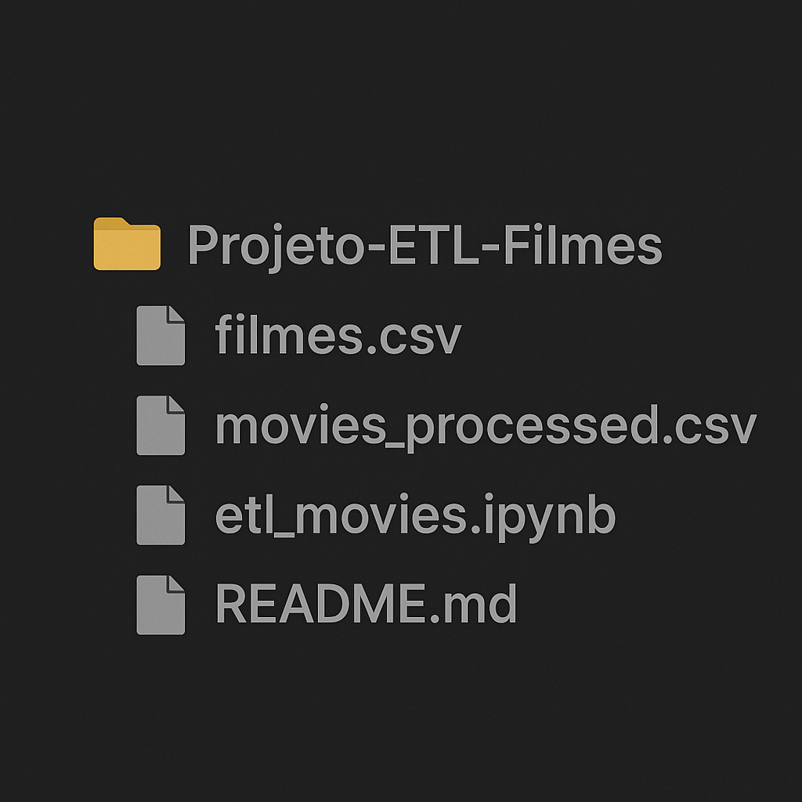

    

-------

 
 

# 🎬 Projeto ETL de Filmes

> ℹ️ **NOTE:** Este projeto demonstra um fluxo ETL simples, porém completo, utilizando uma base fictícia de filmes, desenvolvido como estudo de boas práticas de Python e Pandas.

O objetivo do projeto é:

- Extrair a base de dados bruta (CSV)  
- Transformar os dados aplicando regras de negócio  
- Carregar o resultado processado em um novo arquivo CSV  

O projeto conta com um **notebook Jupyter** documentando todo o processo de forma didática e prática.

## 📂 Estrutura do Repositório

